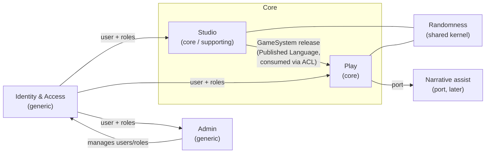

# Context map

Ogami has two core contexts, **Play** and **Studio**. Studio authors game content and publishes immutable, versioned **GameSystem releases**; Play runs campaigns against a release snapshot through an anti-corruption layer, so editing rules never breaks a running campaign. Both depend on **Randomness**, a pure shared kernel for dice and oracles.

Terms in this document are defined in the [glossary](glossary.md).

## Contexts at a glance

| Context | Type | Purpose | Roles |
|---|---|---|---|
| Play | Core | Run solo campaigns: characters, sessions, scenes, flow runs, journal | `SOLO_PLAYER` |
| Studio | Core / supporting | Author game systems and publish releases | `GAME_MANAGER` |
| Randomness | Shared kernel | Dice expressions, oracle tables, likelihood oracles | Used by Play and Studio (no direct users) |
| Identity & Access | Generic | Users, authentication, roles | All roles |
| Admin | Generic | App settings and user management | `OWNER` |
| Narrative assist | Port (later) | AI suggestions for the flow; interface only for now | Used by Play |

## Diagram

## Relationships

| Upstream | Downstream | Pattern | What crosses the boundary |
|---|---|---|---|
| Studio | Play | Published Language + Anti-corruption layer (in Play) | An immutable, versioned GameSystem release. Play stores a snapshot and translates it into its own model. A campaign stays on its release until the player chooses to upgrade |
| Randomness | Play, Studio | Shared kernel | Pure domain types and services: `DiceExpression`, `Roll`, oracle resolution. Changes need agreement of both consumers |
| Identity & Access | Play, Studio, Admin | Open host (conformist consumers) | Current user id and roles |
| Admin | Identity & Access | Customer / supplier | Admin use cases call Identity & Access application services to manage users and roles |
| Play | Narrative assist | Port (hexagonal) | A Play-owned interface; no adapter yet ([ADR 0002](../adr/0002-modular-monolith-hexagonal-ddd.md)) |

Rule edits are safe by design: see [ADR 0010](../adr/0010-versioned-gamesystem-releases.md).

## Contexts

### Play (core)

| Aspect | Detail |
|---|---|
| Responsibilities | Create campaigns on a GameSystem release; create and update characters; run sessions and scenes; drive the FlowRun; ask oracles and make checks; keep the journal, threads and NPCs |
| Aggregates / concepts | Campaign, Character, Session, Scene, FlowRun, JournalEntry, Thread, NPC |
| Depends on | Studio (release snapshot via ACL), Randomness, Identity & Access, Narrative assist port |
| Roles | `SOLO_PLAYER` |

### Studio (core / supporting)

| Aspect | Detail |
|---|---|
| Responsibilities | Author game systems: sheet templates, fields, derived values, checks with outcome bands, narrative flows (including flow presets) and oracles; validate and publish GameSystem releases |
| Aggregates / concepts | GameSystem, GameSystem release, SheetTemplate, Field, DerivedValue, Check, Outcome band, NarrativeFlow, Flow step, Flow preset, Oracle definition |
| Depends on | Randomness (validate dice expressions and oracle tables), Identity & Access |
| Roles | `GAME_MANAGER` |
| Note | Studio is a first-class product surface with rich editors, not an admin panel |

### Randomness (shared kernel)

| Aspect | Detail |
|---|---|
| Responsibilities | Parse and evaluate dice expressions; resolve oracle tables; answer likelihood oracles |
| Aggregates / concepts | DiceExpression, Roll, OracleTable, Likelihood oracle (value objects and pure domain services) |
| Depends on | Nothing. Pure domain, framework-free; randomness source injected so results are testable |
| Roles | None directly; used by Play and Studio |

### Identity & Access (generic)

| Aspect | Detail |
|---|---|
| Responsibilities | User accounts, authentication (session cookie), role assignment |
| Aggregates / concepts | User, Role (`OWNER`, `GAME_MANAGER`, `SOLO_PLAYER`) |
| Published API | `POST /api/auth/login`, `POST /api/auth/logout`, `GET /api/auth/me` (session cookie, [ADR 0006](../adr/0006-session-cookie-auth-roles.md)); console `app:user:create` |
| Depends on | Nothing domain-specific |
| Roles | All |

### Admin (generic)

| Aspect | Detail |
|---|---|
| Responsibilities | App settings and user management for the owner. Nothing about game content |
| Aggregates / concepts | App settings |
| Depends on | Identity & Access |
| Roles | `OWNER` |

### Narrative assist (port, later)

| Aspect | Detail |
|---|---|
| Responsibilities | Suggest ideas for a flow step (e.g. scene prompts, interpretations of oracle answers) |
| Shape | An interface owned by Play; implementation (AI adapter) comes later |
| Roles | Used by Play on behalf of `SOLO_PLAYER` |

## Open questions

Answered when the first feature that needs them starts, not before (see [vision](../vision.md#open-questions)).

| Question | Decide when |
|---|---|
| Is Studio core or supporting? Core for the authoring UX, supporting for Play's value | Studio's first feature |
| Upgrade path for a campaign moving to a newer GameSystem release (character data migration). Default until then: a campaign stays pinned to its release | First Play feature that consumes a release |
| ~~How context boundaries are enforced in code~~ | Resolved: PHPat ([ADR 0012](../adr/0012-phpat-boundary-enforcement.md)) |
